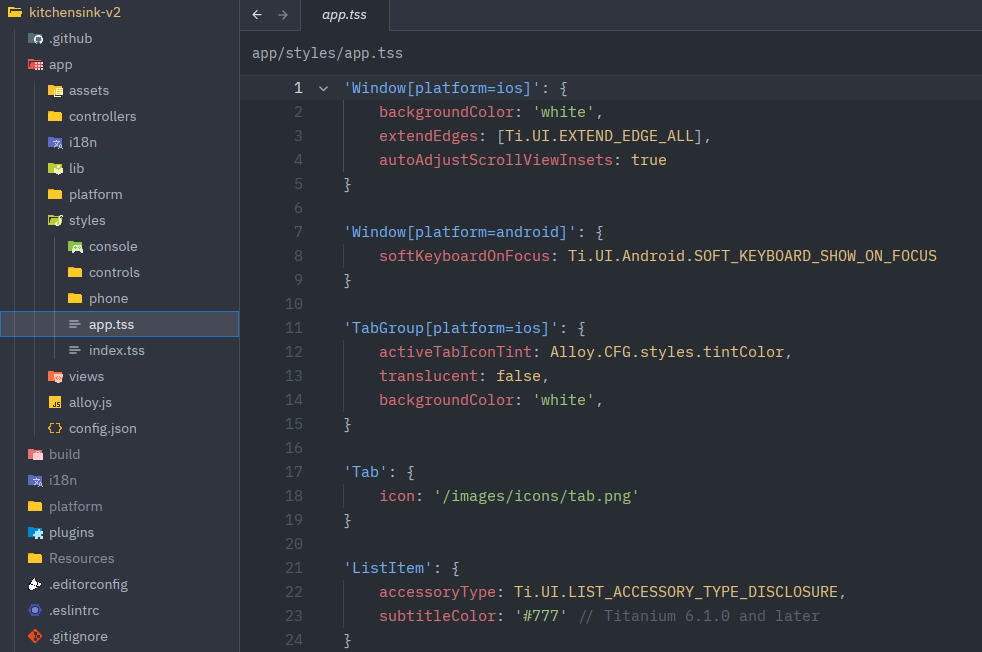

# Titanium SDK Extension for Zed Editor

A Zed Editor extension providing syntax highlighting for Titanium SDK. Currently it supports Alloy TSS files.

## Installation

* Clone the repository
* `zed: extensions` - `Install Dev Extension` - select cloned folder

## Features

### Syntax Highlighting
- TSS files (.tss) have proper syntax highlighting using CSS grammar
- Recognizes selectors (class, ID, tag), properties, values, and comments

## File Types

- **TSS** (.tss) - Titanium Style Sheets

## License

MIT License
